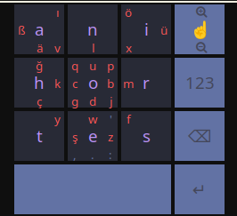

# wvkbd-mk - On-screen keyboard for wlroots optimized for one finger input

wvkbd-mk is optimized for single finger input and is quite a different from other keyboards.
It uses a 3 by 3 grid for the main input. Keys are pressed by tapping or swiping the grid.
See section [Usage](#usage) for details.

This is the layout that wvkbd-mk comes with by default:

The [MessagEase keyboard](https://www.exideas.com/ME/index.php) inspired
wvkbd-mk into existence.

wvkbd-mk is a friendly fork of [wvkbd](https://git.sr.ht/~proycon/wvkbd).

This project aims to deliver a minimal but practically usable implementation of a wlroots on-screen
keyboard in legible C. This will **only** be a keyboard, not a feedback buzzer,
led blinker, or anything that requires more than what's needed to input text
quickly. The end product should be a static codebase that can be patched to add
new features.

## Features

 - Typing, modifier locking, layout switching
 - Custom layouts and underlying keymaps
 - On-the-fly layout and keymap switching
 - Custom color schemes
 - Proper font drawing
 - Support for 'Copy' keys which are not on the keymap
 - Emoji support
 - Compose key for character variants (e.g. diacritics)
 - Show/hide keyboard on signals (SIGUSR1 = hide, SIGUSR2 = show, SIGRTMIN = toggle)
 - Automatic portrait/landscape detection and subsequent layout switching

There are some areas that still need work:

 - Make motion keys a property of the layout, so that we can have "normal" layouts
   together with motion key layouts.
 - International layouts (cyrillic, arabic, persian, greek, georgian)
 - Automatic portrait/landscape detection and subsequent layout switching
 - Make sure the virtual input method in wayland is working as best as it can
 - Support for input method protocol in wayland, ability to respond to text
   fields

## Install

You'll need the following developer packages

 - cairo
 - pango
 - wayland-client
 - xkbcommon

You also need [scdoc](https://git.sr.ht/~sircmpwn/scdoc/) to generate the documentation.

Make any customizations you would like in `config.def.h` and run `make`

The default set of layouts is called `anihortes` *(name is based on the keys that are accessible by single tap)*, which groups various layouts aimed at mobile devices
and also attempts to accommodate various international users. The resulting binary is called `wvkbd-mobintl`.

You can, however, define your own layouts by copying and modifying `layout.anihortes.h` and `keymap.anihortes.h`
(replace `anihortes` for something like `yourlayout`). Then make your layout set using `make LAYOUT=yourlayout`, and
the resulting binary will be `wvkbd-yourlayout`

## Usage

Run `wvkbd-anihortes --motion-keys` (or the binary for your custom layout set).

TODO: Describe the layout, describe the handling
 - Tap
 - Circle
 - Swipe
 - Swipe and return
 - Long tap

You can switch between the layouts/layers of the keyboard by pressing the
⌨ key (little keyboard) the bottom-left (press shift to iterate back instead of
forward). If you only want a subset of the available layers, you can define
which you want and in what order you want to cycle through them using the
`-l` parameter (or `--landscape-layers` for landscape mode). This takes takes a ordered comma separated list of layout names
that are defined in your layout set.

The keyboard can be hidden by sending it a `SIGUSR1` signal, shown again by sending it `SIGUSR2` or toggled by sending it `SIGRTMIN`.
This saves some start up time and may be appropriate in some low-resource environments.

Wvkbd has an output mode `-o` that will echo its output to standard output. This facility can be used if users want
audio/haptic feedback, a feature explicitly out of scope for wvkbd. To achieve this, simply pipe wvkbd's output through the external tool
[clickclack](https://git.sr.ht/~proycon/clickclack):

`$ wvkbd-mobintl -l simple,special,emoji -o | clickclack -V -f keypress.wav`

Another output mode, `-O` will let the keyboard output keys which are swiped over. It can be used by an external program, such as [swipeGuess](https://git.sr.ht/~earboxer/swipeGuess) to get swipe-typing support.

`$ wvkbd-mobintl -O | swipeGuess.sh words.txt | completelyTypeWord.sh`

### Compose button

The default mobile international layout features a Compose button (`Cmp`)
which, when combined with another key, opens up a layout that offers variants
for that key. This is similar to functionality that other keyboards implemented
using a *long press* (wvkbd has no such notion, holding a key will repeat
it like on a physical keyboard).

For example, press Cmp + a to access variants with diacritics like á,à,â,ä, etc.. 

Most layouts also feature the following that are less obvious:

* Press Cmp + ``.`` to access more punctuation
* Press Cmp + ``-`` or ``,`` to access 'mathematical' symbols (+,-,=,etc)
* Press Cmp + ``'`` or ``0`` or ``9`` to access more brackets and quotes
* Press Cmp + ``q`` to access emojis

Last, but not least, pressing Cmp + space or Cmp + ⌨  or Cmp + Abc opens up an index that allows you to immediately jump to any
layout by name, even layouts not explicitly added to your layers on startup.

## Contribute

Any contributions are welcome, there are two ways to contribute, the first one is **preferred**:

1. [Sourcehut](https://git.sr.ht/~proycon/wvkbd) - Submit your patches using `git mail` to [~mil/sxmo-devel@lists.sr.ht](mailto:~mil/sxmo-devel@lists.sr.ht), follow [these contribution guidelines](https://sxmo.org/contribute/). Questions can also be asked on Sxmo's [mailing lists](https://sxmo.org/support/).
2. [Github](https://github.com/jjsullivan5196/wvkbd/) - Submit a pull request or open an issue *(legacy method)*

This project was started by [John Sullivan](https://jsullivan.cc/) and is
currently being maintained by the [Sxmo](https://sxmo.org) project, whose
maintainers will ensure both git remotes are kept in sync at all times.

For code contributions, please run `make format` (requires `clang-format`)
before sending a patch (opening a PR) and include as much relevant detail as
possible.

## Related projects

* [clickclack](https://git.sr.ht/~proycon/clickclack) - Audio/haptic feedback (standalone)
* [swipeGuess](https://git.sr.ht/~earboxer/swipeGuess) - Word-completion for swipe-typing
* [Sxmo](https://sxmo.org) - A hackable mobile interface environment for Linux phones that adopted wvkbd as its keyboard
* [svkbd](https://tools.suckless.org/x/svkbd/) - A similar project as wvkbd but for X11 rather than Wayland
* [squeekboard](https://gitlab.gnome.org/World/Phosh/squeekboard) - The virtual keyboard developed for the Librem5 (used
	by Phosh)
